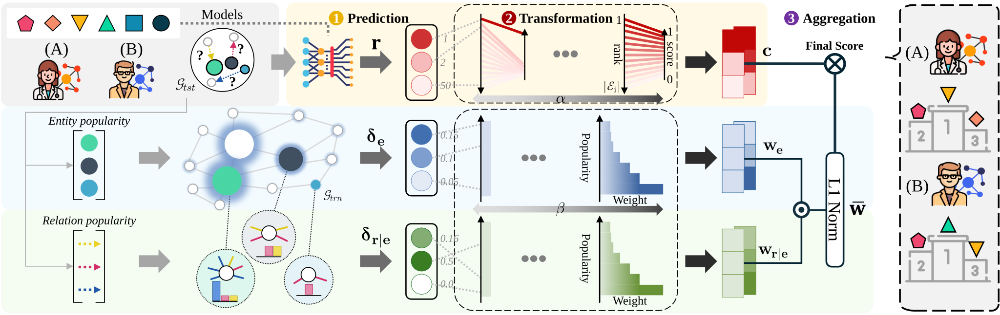

# Generalized Rank-based Evaluation for Knowledge Graph Completion: Perspectives, Framework, and Analyses
This repository provides the implementation of PROBE and its integration with existing Knowledge Graph Completion (KGC) models. It also contains the code required to reproduce the experimental results and figures presented in the paper.
## Overview of PROBE


## 📁 KnowledgeGraphEmbedding
This directory demonstrates how PROBE can be integrated into KGC training pipelines and used to evaluate models throughout the training process.

### Installation and Usage

We recommend using Python 3.11 or later.
```
cd KnowledgeGraphEmbedding
pip install -r requirements.txt

bash best_config.sh
```

## 📁 Testing
This directory contains the code used to generate all figures reported in the paper.

To reproduce the figures, uncomment the desired plotting functions in the source code and run:
```
cd Testing
pip install -r requirements.txt

cd src
python run.py
```
Only the figures corresponding to the enabled plotting functions will be generated.

## Requirements
Python >= 3.11
Dependencies listed in requirements.txt

## Citation

If you find this repository useful in your research, please consider citing our paper.
```
@article{moon2026generalized,
  title={Generalized Rank-based Evaluation for Knowledge Graph Completion: Perspectives, Framework, and Analyses},
  author={Moon, Sooho and Kang, Jian and Ko, Yunyong},
  journal={ACM Transactions on Knowledge Discovery from Data},
  year={2026}
}
```

## Acknowledgement
We thank the original authors for their great works.